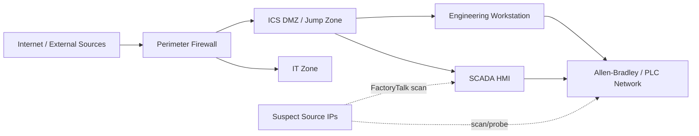

# Optional Add-On: OT Attack Click-by-Click Guide

Lab add-on for: `iran-cyber-risk-escalation-20260430-2055`

Primary source article:
- Unit 42 Threat Brief: Escalation of Cyber Risk Related to Iran (Updated April 17)
- https://unit42.paloaltonetworks.com/iranian-cyberattacks-2026/

---

## Why this add-on exists

The main exercise covers phishing, DNS, firewall, DDoS, and wiper activity. This optional add-on zooms in on one specific area: **OT targeting behavior**.

This is intentionally simple and practical. You are not reverse engineering malware or simulating PLC damage. You are doing what detection engineers actually do first:

1. Identify suspicious OT-relevant events.
2. Separate likely reconnaissance from normal inventory noise.
3. Build a small, defensible timeline.
4. Write a few actionable detections.

---

## Learning goal (keep it simple)

By the end, you should be able to answer these four questions:

1. Which events in this lab suggest OT scanning/probing activity?
2. Which source IPs and destinations are most suspicious?
3. Which services/ports were touched (for example 44818 and 502)?
4. What 3-4 detections can catch this early next time?

---

## Data used in this add-on

Use this file:

```text
labs/iran-cyber-risk-escalation-20260430-2055/data/ot-ics.jsonl
```

Useful terms in this dataset:

- `factorytalk_scan`
- `allen_bradley_plc_probe`
- `asset_inventory`
- `FactoryTalk`
- `Allen-Bradley`
- `Rockwell Automation`
- `CL-STA-1128`
- `Cyber Av3ngers`
- `Storm-0784`

## OT network diagram (simple reference)



How to use this diagram:

- Treat external-to-PLC or external-to-HMI probing as high risk.
- Treat IT-to-PLC traffic as suspicious unless explicitly approved.
- Prioritize events where source IP is external and destination port is OT-relevant.

---

## Part 1: Quick triage in plain language

Start with this mindset:

- `asset_inventory` can be benign.
- `factorytalk_scan` and `allen_bradley_plc_probe` are high-signal in this lab.
- External source IPs touching OT ports/services should be treated as suspicious until proven otherwise.

What we are trying to find quickly:

- repeated probing behavior
- concentration around OT protocols/services
- any clustering in time that looks like campaign activity

---

## Part 2: Step-by-step in Splunk

### Step 1: Load OT dataset (if not already loaded)

1. Open Splunk Web.
2. Go to **Settings** → **Add Data**.
3. Click **Upload**.
4. Select:

```text
labs/iran-cyber-risk-escalation-20260430-2055/data/ot-ics.jsonl
```

5. Choose `_json` sourcetype.
6. Send to your class index (example: `de_iran_lab`).
7. Open **Search & Reporting**.
8. Set time to **All time**.

### Step 2: Confirm ingestion count

```spl
index=de_iran_lab event.dataset="ot-ics"
| stats count
```

Expected: around 100 events.

### Step 3: See event-type distribution

```spl
index=de_iran_lab event.dataset="ot-ics"
| stats count by event_type
| sort - count
```

What to note:

- how many `asset_inventory` events
- how many `factorytalk_scan`
- how many `allen_bradley_plc_probe`

### Step 4: Isolate likely malicious OT activity

```spl
index=de_iran_lab event.dataset="ot-ics" (event_type="factorytalk_scan" OR event_type="allen_bradley_plc_probe")
| table _time host.name user.name source.ip destination.ip destination.port service.name ot.vendor ot.product threat.actor severity message
| sort _time
```

This is your core high-signal set.

### Step 5: Find top suspicious source IPs

```spl
index=de_iran_lab event.dataset="ot-ics" (event_type="factorytalk_scan" OR event_type="allen_bradley_plc_probe")
| stats count values(event_type) as event_types values(destination.ip) as targets values(destination.port) as ports by source.ip threat.actor
| sort - count
```

What to look for:

- one source hitting multiple OT destinations
- overlap between source IP and named threat actor context in the event

### Step 6: Check targeted OT services and ports

```spl
index=de_iran_lab event.dataset="ot-ics" (event_type="factorytalk_scan" OR event_type="allen_bradley_plc_probe")
| stats count by destination.port service.name
| sort - count
```

Interpretation guidance:

- `44818` is commonly associated with EtherNet/IP and PLC communications.
- `502` is Modbus/TCP.
- unexpected external access attempts to these ports are high priority.

### Step 7: Build a compact OT incident timeline

```spl
index=de_iran_lab event.dataset="ot-ics" (event_type="factorytalk_scan" OR event_type="allen_bradley_plc_probe" OR event_type="asset_inventory")
| table _time event_type source.ip destination.ip destination.port service.name threat.actor severity message
| sort _time
```

In your notes, extract:

- first suspicious OT event time
- first source IP observed probing OT targets
- any sequence pattern (scan first, broader probing later)

---

## Part 3: Write 4 simple OT detections

Use these as starter detections.

### Detection A: FactoryTalk scanning activity

```spl
index=de_iran_lab event.dataset="ot-ics" event_type="factorytalk_scan"
| stats count values(source.ip) as src values(destination.ip) as dst values(destination.port) as ports by threat.actor
```

### Detection B: Allen-Bradley PLC probing

```spl
index=de_iran_lab event.dataset="ot-ics" event_type="allen_bradley_plc_probe"
| stats count values(source.ip) as src values(destination.ip) as dst values(service.name) as services by threat.actor
```

### Detection C: External source to OT-critical ports

```spl
index=de_iran_lab event.dataset="ot-ics" destination.port IN (44818,502)
| eval src_is_external=if(cidrmatch("10.0.0.0/8",source.ip) OR cidrmatch("172.16.0.0/12",source.ip) OR cidrmatch("192.168.0.0/16",source.ip),0,1)
| where src_is_external=1
| stats count values(event_type) as event_types by source.ip destination.ip destination.port
| sort - count
```

### Detection D: Burst of OT probe events by one source

```spl
index=de_iran_lab event.dataset="ot-ics" (event_type="factorytalk_scan" OR event_type="allen_bradley_plc_probe")
| bin _time span=10m
| stats count by _time source.ip
| where count >= 3
| sort _time
```

---

## Part 4: False-positive handling (important)

Do not skip this section in your report.

Potential false positives:

- legitimate OT asset discovery tools
- maintenance window scanning from approved jump hosts
- engineering workstation health checks

How to tune safely:

1. Allowlist known scanner IPs that are approved.
2. Restrict high-severity alerts to critical OT segments only.
3. Raise priority when source is external or unknown.
4. Raise priority when multiple probe types occur from same source within short window.

---

## Part 5: Tiny incident-response playbook for this add-on

If this detection fired in a real environment:

1. Validate source IP ownership and geolocation.
2. Confirm destination assets are true OT/ICS systems.
3. Block or rate-limit suspicious source at perimeter.
4. Review firewall and IDS telemetry for same source/time window.
5. Notify OT operations before making disruptive containment changes.

Short and practical is fine here.

---

## Part 6: Submission format for this optional add-on

Keep it concise.

### A) Findings (5-8 bullets)

Include:

- top suspicious source IPs
- targeted OT services/ports
- time window of suspicious activity
- relevant threat actor tags observed in telemetry

### B) Timeline (small table)

```text
Time | Event Type | Source IP | Destination IP | Port | Why suspicious
```

### C) Detections (4)

For each detection include:

- SPL query
- what it catches
- one likely false positive
- one tuning improvement

### D) Response recommendations (3-5 bullets)

Focus on actions that SOC + OT teams can realistically execute.

---

## Completion checklist

- [ ] confirmed OT dataset ingestion
- [ ] identified scan/probe event types
- [ ] identified top suspicious source IPs
- [ ] mapped key OT ports/services targeted
- [ ] created a compact OT timeline
- [ ] wrote 4 simple OT-focused detections
- [ ] documented false-positive handling and tuning

If you can explain this clearly to another analyst in 5 minutes, you did it right.