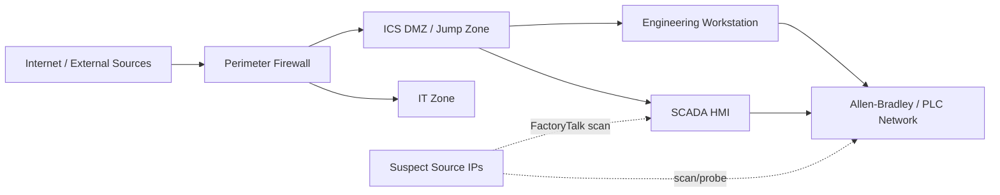

# OT Attack Click-by-Click Guide (Splunk-Only)

Guide for lab: `iran-cyber-risk-escalation-20260430-2055`

Primary source article:
- Unit 42 Threat Brief: Escalation of Cyber Risk Related to Iran (Updated April 17)
- https://unit42.paloaltonetworks.com/iranian-cyberattacks-2026/

---

## Why this guide exists

The main exercise covers phishing, DNS, firewall, DDoS, and wiper activity. This guide zooms in on one specific area: **OT targeting behavior**.

This guide is beginner-friendly. You are not expected to be an OT engineer. The goal is to build confidence in OT-focused detection thinking with clear, repeatable SPL workflows.

---

## OT 101 mini-primer

- **HMI**: operator interface.
- **Engineering Workstation**: config/programming host.
- **PLC network**: controllers that run physical processes.

Why OT is different: scanning that is normal in IT can be disruptive in OT.

Ports in this lab:
- **44818** (common in EtherNet/IP and Allen-Bradley contexts)
- **502** (Modbus/TCP)

---

## Data used in this guide

```text
labs/iran-cyber-risk-escalation-20260430-2055/data/ot-ics.jsonl
```

Useful terms:
- `factorytalk_scan`
- `allen_bradley_plc_probe`
- `asset_inventory`
- `FactoryTalk`
- `Allen-Bradley`
- `Rockwell Automation`

---

## OT network diagram



---

## Part 1: Step-by-step in Splunk with query explanations

### Step 1: Confirm OT data is ingested

```spl
index=de_iran_lab event.dataset="ot-ics"
| stats count
```

**What this query does**
- Counts OT events in your Splunk index.

**Query breakdown**
- `index=de_iran_lab`: search only your class index.
- `event.dataset="ot-ics"`: keep only OT dataset events.
- `| stats count`: return one total count.

**How to read the result**
- Near 100 means ingestion worked.
- 0 usually means wrong index, time range, or sourcetype.

---

### Step 2: Understand event-type mix

```spl
index=de_iran_lab event.dataset="ot-ics"
| stats count by event_type
| sort - count
```

**What this query does**
- Shows how many events exist for each OT event type.

**Query breakdown**
- `stats count by event_type`: group rows by `event_type` and count each group.
- `sort - count`: highest counts first.

**How to read the result**
- `asset_inventory` is usually larger and can be benign.
- `factorytalk_scan` and `allen_bradley_plc_probe` are higher signal.

---

### Step 3: Pull likely suspicious OT events

```spl
index=de_iran_lab event.dataset="ot-ics" (event_type="factorytalk_scan" OR event_type="allen_bradley_plc_probe")
| table _time host.name user.name source.ip destination.ip destination.port service.name ot.vendor ot.product threat.actor severity message
| sort _time
```

**What this query does**
- Isolates scan/probe events and shows analyst-friendly fields.

**Query breakdown**
- `(A OR B)`: include either scan type.
- `table ...`: keep only fields you care about.
- `sort _time`: show event flow in time order.

**How to read the result**
- Repeated source IPs and OT ports are priority.
- Critical severity + external source is stronger signal.

---

### Step 4: Identify top suspicious source IPs

```spl
index=de_iran_lab event.dataset="ot-ics" (event_type="factorytalk_scan" OR event_type="allen_bradley_plc_probe")
| stats count values(event_type) as event_types values(destination.ip) as targets values(destination.port) as ports by source.ip threat.actor
| sort - count
```

**What this query does**
- Ranks source IPs by how much suspicious OT activity they generated.

**Query breakdown**
- `stats count ... by source.ip threat.actor`: one row per source/threat-actor combo.
- `values(...)`: shows unique event types, targets, and ports touched.

**How to read the result**
- Highest count sources go to top of triage queue.
- Sources hitting many targets/ports are more concerning.

---

### Step 5: See what OT ports/services are targeted

```spl
index=de_iran_lab event.dataset="ot-ics" (event_type="factorytalk_scan" OR event_type="allen_bradley_plc_probe")
| stats count by destination.port service.name
| sort - count
```

**What this query does**
- Summarizes which destination ports/services were targeted most.

**Query breakdown**
- `count by destination.port service.name`: pair each port with service label.

**How to read the result**
- Port 44818 or 502 activity supports OT reconnaissance hypothesis.
- High counts on one OT-relevant port can indicate focused probing.

---

### Step 6: Build OT timeline

```spl
index=de_iran_lab event.dataset="ot-ics" (event_type="factorytalk_scan" OR event_type="allen_bradley_plc_probe" OR event_type="asset_inventory")
| table _time event_type source.ip destination.ip destination.port service.name threat.actor severity message
| sort _time
```

**What this query does**
- Produces a simple timeline across suspicious and baseline-like OT events.

**Query breakdown**
- Includes `asset_inventory` to compare noise vs suspicious activity.
- `table` keeps timeline fields concise.

**How to read the result**
- Identify first suspicious event.
- Check if scans/probes cluster in short windows.
- Note if same source appears across multiple event types.

---

## Worked mini-example

```text
09:09:51Z | factorytalk_scan        | 91.219.236.42  -> 10.77.4.16:8080
09:10:10Z | factorytalk_scan        | 193.32.162.77 -> 10.77.4.17:44818
09:22:58Z | allen_bradley_plc_probe | 91.219.236.42 -> 10.77.4.29:502
09:23:17Z | allen_bradley_plc_probe | 193.32.162.77 -> 10.77.4.30:8080
```

---

## Part 2: OT detections with descriptions

### Detection A: FactoryTalk scan detection

```spl
index=de_iran_lab event.dataset="ot-ics" event_type="factorytalk_scan"
| stats count values(source.ip) as src values(destination.ip) as dst values(destination.port) as ports by threat.actor
```

**Purpose**
- Detect FactoryTalk-oriented scan behavior.

**How it works**
- Filters only `factorytalk_scan` events.
- Aggregates source/destination/ports by `threat.actor`.

---

### Detection B: Allen-Bradley PLC probe detection

```spl
index=de_iran_lab event.dataset="ot-ics" event_type="allen_bradley_plc_probe"
| stats count values(source.ip) as src values(destination.ip) as dst values(service.name) as services by threat.actor
```

**Purpose**
- Detect direct PLC probing behavior.

**How it works**
- Filters only `allen_bradley_plc_probe` events.
- Summarizes which sources targeted which destinations/services.

---

### Detection C: External source to OT-critical ports

```spl
index=de_iran_lab event.dataset="ot-ics" destination.port IN (44818,502)
| eval src_is_external=if(cidrmatch("10.0.0.0/8",source.ip) OR cidrmatch("172.16.0.0/12",source.ip) OR cidrmatch("192.168.0.0/16",source.ip),0,1)
| where src_is_external=1
| stats count values(event_type) as event_types by source.ip destination.ip destination.port
| sort - count
```

**Purpose**
- High-priority detection for external-to-OT port communication.

**How it works**
- Keeps OT-critical ports only.
- Marks RFC1918 ranges as internal and others as external.
- Keeps only external source events.

---

### Detection D: Burst probing detection

```spl
index=de_iran_lab event.dataset="ot-ics" (event_type="factorytalk_scan" OR event_type="allen_bradley_plc_probe")
| bin _time span=10m
| stats count by _time source.ip
| where count >= 3
| sort _time
```

**Purpose**
- Catch short-window probe bursts.

**How it works**
- Groups time into 10-minute buckets.
- Counts events per source per bucket.
- Flags buckets with count >= 3.

---

## Part 3: False positives and tuning

Common false positives:
- legitimate OT discovery tools,
- maintenance scans,
- approved jump-host checks.

Simple tuning:
1. Allowlist known scanner IPs.
2. Lower priority during approved maintenance windows.
3. Raise severity when source is external and unknown.
4. Raise severity when both scan types occur from same source in 30 minutes.

---

## Part 4: Submission checklist

- [ ] OT data ingested and validated
- [ ] event-type distribution explained
- [ ] suspicious source IPs identified
- [ ] OT ports/services summarized
- [ ] timeline created
- [ ] 4 detections documented with purpose/how-they-work
- [ ] false-positive tuning included
