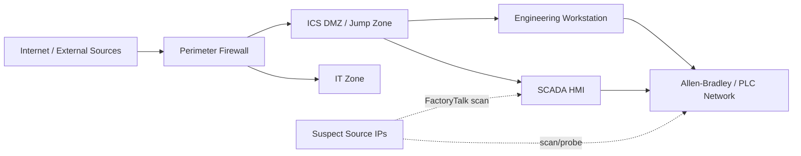

# OT Attack Click-by-Click Guide (Splunk-Only)

Guide for lab: `iran-cyber-risk-escalation-20260430-2055`

Primary source article:
- Unit 42 Threat Brief: Escalation of Cyber Risk Related to Iran (Updated April 17)
- https://unit42.paloaltonetworks.com/iranian-cyberattacks-2026/

---

## Why this guide exists

The main exercise covers phishing, DNS, firewall, DDoS, and wiper activity. This optional add-on zooms in on one specific area: **OT targeting behavior**.

This add-on is intentionally beginner-friendly. You are not expected to be an OT engineer. The goal is to build confidence in OT-focused detection thinking using simple, repeatable steps.

What you will do:

1. Identify suspicious OT-relevant events.
2. Separate likely reconnaissance from normal inventory noise.
3. Build a small, defensible timeline.
4. Write practical detections in SPL.

---

## OT 101 mini-primer (for students new to OT)

### What is OT in this context?

Operational Technology (OT) includes systems that monitor/control physical processes, such as industrial controllers and plant-floor devices.

In this lab, think of these core components:

- **HMI (Human Machine Interface)**: operator screen and control console.
- **Engineering Workstation**: used to configure logic, projects, and updates.
- **PLC network**: controllers that manage physical equipment.

### Why OT traffic is treated differently than IT traffic

In many enterprise IT environments, scanning is common and often expected. In OT, scanning can be risky because:

- some legacy devices are fragile,
- unusual traffic can interrupt operations,
- even “read-only” probing may indicate pre-attack reconnaissance.

### Ports to care about in this add-on

- **44818**: commonly associated with EtherNet/IP and Allen-Bradley environments.
- **502**: commonly associated with Modbus/TCP.

You are not proving an exploit happened. You are detecting behavior that suggests reconnaissance and potential preparation.

---

## Learning goal (keep it simple)

By the end, answer these four questions:

1. Which events in this lab suggest OT scanning/probing activity?
2. Which source IPs and destinations are most suspicious?
3. Which services/ports were touched (for example 44818 and 502)?
4. What 4 detections can catch this earlier next time?

---

## Data used in this add-on

Use this file:

```text
labs/iran-cyber-risk-escalation-20260430-2055/data/ot-ics.jsonl
```

Useful terms in this dataset:

- `factorytalk_scan`
- `allen_bradley_plc_probe`
- `asset_inventory`
- `FactoryTalk`
- `Allen-Bradley`
- `Rockwell Automation`
- `CL-STA-1128`
- `Cyber Av3ngers`
- `Storm-0784`

---

## OT network diagram (simple reference)



How to use this diagram:

- External-to-PLC or external-to-HMI probing is high risk.
- IT-to-PLC traffic is suspicious unless explicitly approved.
- OT-relevant destination ports plus unknown external source should raise priority.

---

## Part 1: Quick triage mindset

Use this logic throughout the exercise:

- `asset_inventory` can be normal depending on environment.
- `factorytalk_scan` and `allen_bradley_plc_probe` are higher signal.
- repeated events from same source are more suspicious than one-off noise.
- external source IPs to OT ports deserve immediate review.

---

## Part 2: Step-by-step in Splunk

### Step 1: Load OT dataset (if not already loaded)

1. Open Splunk Web.
2. Go to **Settings** → **Add Data**.
3. Click **Upload**.
4. Select:

```text
labs/iran-cyber-risk-escalation-20260430-2055/data/ot-ics.jsonl
```

5. Choose `_json` sourcetype.
6. Send to your class index (example: `de_iran_lab`).
7. Open **Search & Reporting**.
8. Set time to **All time**.

### Step 2: Confirm ingestion count

```spl
index=de_iran_lab event.dataset="ot-ics"
| stats count
```

Expected: around 100 events.

**How to interpret:**
- If count is close to 100, ingest worked.
- If count is 0, index/time range/sourcetype are likely wrong.

### Step 3: See event-type distribution

```spl
index=de_iran_lab event.dataset="ot-ics"
| stats count by event_type
| sort - count
```

**How to interpret:**
- You should see many `asset_inventory` events.
- You should also see smaller buckets of `factorytalk_scan` and `allen_bradley_plc_probe`.
- Small but high-severity buckets are often where detection value lives.

### Step 4: Isolate likely malicious OT activity

```spl
index=de_iran_lab event.dataset="ot-ics" (event_type="factorytalk_scan" OR event_type="allen_bradley_plc_probe")
| table _time host.name user.name source.ip destination.ip destination.port service.name ot.vendor ot.product threat.actor severity message
| sort _time
```

**How to interpret:**
- Treat this result set as your “investigation core.”
- Look for repeated source IPs, repeated destination ranges, and critical severity.
- Note whether `threat.actor` tags are present.

### Step 5: Find top suspicious source IPs

```spl
index=de_iran_lab event.dataset="ot-ics" (event_type="factorytalk_scan" OR event_type="allen_bradley_plc_probe")
| stats count values(event_type) as event_types values(destination.ip) as targets values(destination.port) as ports by source.ip threat.actor
| sort - count
```

**How to interpret:**
- Prioritize source IPs with highest counts.
- Prioritize sources touching multiple OT targets/ports.
- If one source triggers both scan/probe types, elevate severity.

### Step 6: Check targeted OT services and ports

```spl
index=de_iran_lab event.dataset="ot-ics" (event_type="factorytalk_scan" OR event_type="allen_bradley_plc_probe")
| stats count by destination.port service.name
| sort - count
```

**How to interpret:**
- Activity on 44818 and 502 supports OT reconnaissance hypothesis.
- Unknown or generic service labels with OT ports can still be suspicious.
- High volume toward one port can indicate targeted protocol probing.

### Step 7: Build a compact OT incident timeline

```spl
index=de_iran_lab event.dataset="ot-ics" (event_type="factorytalk_scan" OR event_type="allen_bradley_plc_probe" OR event_type="asset_inventory")
| table _time event_type source.ip destination.ip destination.port service.name threat.actor severity message
| sort _time
```

**How to interpret:**
- Find earliest suspicious event.
- Map whether suspicious scan/probe events appear in clusters.
- Note if benign-like inventory events happen before/after suspicious events from same source.

---

## Worked mini-example (what a good timeline looks like)

Use this as a model for your own output.

```text
09:09:51Z | factorytalk_scan           | 91.219.236.42  -> 10.77.4.16:8080 | first suspicious scan
09:10:10Z | factorytalk_scan           | 193.32.162.77 -> 10.77.4.17:44818 | OT protocol-relevant target
09:22:58Z | allen_bradley_plc_probe    | 91.219.236.42 -> 10.77.4.29:502   | probing broadens to PLC/Modbus
09:23:17Z | allen_bradley_plc_probe    | 193.32.162.77 -> 10.77.4.30:8080  | repeated external probing behavior
```

Why this matters:
- multiple external sources,
- repeated OT-specific behavior,
- progression from scanning to direct PLC-related probing.

---

## Part 3: Write 4 simple OT detections

### Detection A: FactoryTalk scanning activity

```spl
index=de_iran_lab event.dataset="ot-ics" event_type="factorytalk_scan"
| stats count values(source.ip) as src values(destination.ip) as dst values(destination.port) as ports by threat.actor
```

Use when: you want a focused analytic for FactoryTalk-style reconnaissance.

### Detection B: Allen-Bradley PLC probing

```spl
index=de_iran_lab event.dataset="ot-ics" event_type="allen_bradley_plc_probe"
| stats count values(source.ip) as src values(destination.ip) as dst values(service.name) as services by threat.actor
```

Use when: you want direct visibility into PLC probe behavior.

### Detection C: External source to OT-critical ports

```spl
index=de_iran_lab event.dataset="ot-ics" destination.port IN (44818,502)
| eval src_is_external=if(cidrmatch("10.0.0.0/8",source.ip) OR cidrmatch("172.16.0.0/12",source.ip) OR cidrmatch("192.168.0.0/16",source.ip),0,1)
| where src_is_external=1
| stats count values(event_type) as event_types by source.ip destination.ip destination.port
| sort - count
```

Use when: you want a high-priority signal for external-to-OT communication attempts.

### Detection D: Burst of OT probe events by one source

```spl
index=de_iran_lab event.dataset="ot-ics" (event_type="factorytalk_scan" OR event_type="allen_bradley_plc_probe")
| bin _time span=10m
| stats count by _time source.ip
| where count >= 3
| sort _time
```

Use when: you want to catch short-window burst behavior associated with active reconnaissance.

---

## Part 4: False-positive handling (beginner-friendly)

Potential false positives:

- legitimate OT asset discovery tools,
- planned maintenance scans,
- approved engineering scans from known jump hosts.

Practical tuning examples:

1. Allowlist known scanner IPs, for example an approved jump host list.
2. Suppress alerts during approved maintenance window tags.
3. Raise severity only when source is external OR source not in approved OT scanner list.
4. Raise severity when same source triggers both `factorytalk_scan` and `allen_bradley_plc_probe` within 30 minutes.
5. Raise severity when destination port is 44818 or 502 and source is new/unknown.

---

## Part 5: Tiny incident-response playbook for this add-on

If one of these detections fires in production:

1. Validate source IP ownership and geolocation.
2. Confirm destination systems are true OT/ICS assets.
3. Check if source is on approved scanner list.
4. If not approved, contain at perimeter (block/rate-limit).
5. Review related firewall/IDS logs for same source and time window.
6. Coordinate with OT operations before disruptive changes.

---

## Part 6: Submission format

### A) Findings (5-8 bullets)

Include:

- top suspicious source IPs,
- targeted OT services/ports,
- time window of suspicious activity,
- threat actor tags observed in telemetry.

### B) Timeline (small table)

```text
Time | Event Type | Source IP | Destination IP | Port | Why suspicious
```

### C) Detections (4)

For each detection include:

- SPL query,
- what it catches,
- one likely false positive,
- one tuning improvement.

### D) Response recommendations (3-5 bullets)

Focus on realistic SOC + OT actions.

---

## Completion checklist

- [ ] confirmed OT dataset ingestion
- [ ] identified scan/probe event types
- [ ] identified top suspicious source IPs
- [ ] mapped key OT ports/services targeted
- [ ] created a compact OT timeline
- [ ] wrote 4 OT-focused detections
- [ ] documented false-positive handling and tuning

If you can explain your findings to another analyst in 5 minutes, you are in great shape.